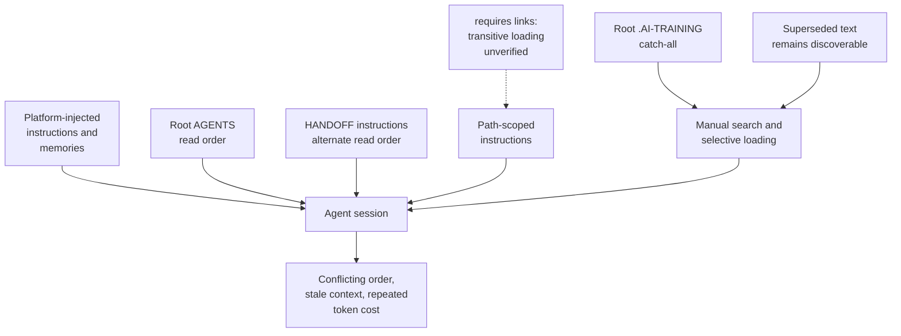
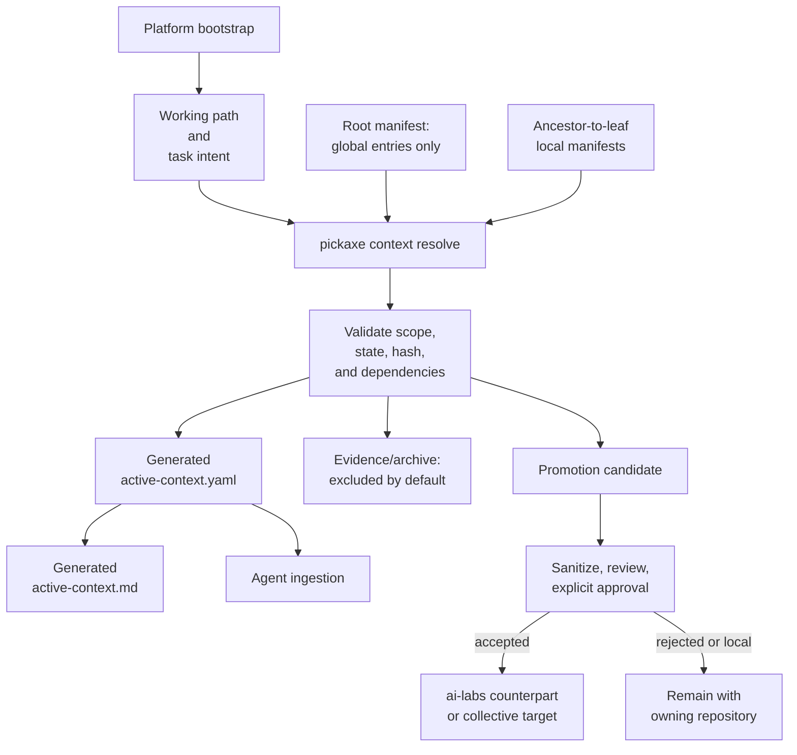

# AI Training Manifest Contract

```
# --------------------------------------------------------------------------
# NOTES:    AI-TRAINING-MANIFEST.md
# --------------------------------------------------------------------------
# ABSTRACT: Pickaxe contract for nearest-owner AI training stores, active
#           context resolution, evidence isolation, and governed promotion.
# CREATED:  260725 BY: GitHub Copilot
# UPDATED:  260725 BY: GitHub Copilot
# ARCHITECT: JN (Joe Negron -- LogicWizards.NYC)
# TECHLEAD:  JN (Joe Negron -- LogicWizards.NYC)
# VERSION:  0.1.0
# STAGE:    DRAFT
# --------------------------------------------------------------------------
```

**Owner:** pickaxe [Track E](../ROADMAP.md#track-e--manifest-management--workspace-sync)
**Protocol:** ai-labs Federation [F2](../../ai-labs/federation/FEATURES/F2-inheritance-layer-cake.md), [F4](../../ai-labs/federation/FEATURES/F4-knowledge-classification-and-promotion.md), and [F7](../../ai-labs/federation/FEATURES/F7-manifest-replication-protocol.md)
**Status:** design contract; no command in this document is implemented yet

## Decision

AI training artifacts are checked into the repository that owns them. Every repo or independently governed subtree MAY have a local `.AI-TRAINING/`; the nearest owning node receives the artifact. The workspace-root `.AI-TRAINING/` is reserved for genuinely workspace-wide material, not used as a catch-all.

Git preserves history. Active context files therefore MUST contain only current policy and state. Superseded, retracted, and evidence-only artifacts remain auditable in git or an archive excluded from default ingestion; a supersession banner does not make an otherwise discoverable file safe to ingest.

[Pickaxe](../README.md) is the sole resolver and synchronization implementation. [ai-labs](../../ai-labs/README.md) owns the protocol and promotion targets. [ai-labs-toolkit](../../vsCode/ai-labs-toolkit/README.md) MAY render pickaxe output later but MUST NOT independently walk, classify, or synchronize the tree.

## AS-IS



The current environment is hybrid: some context is injected by the platform, repository files prescribe manual reads, and `.AI-TRAINING` is read by convention or explicit search. No verified mechanism automatically walks every `requires:` edge or resolves one authoritative active view.

## TO-BE



## Ownership Resolution

Given an artifact path or proposed scope, pickaxe walks from the workspace root toward the target and collects manifests in ancestor-to-leaf order.

1. A repository boundary or explicit manifest `node.root` establishes an owning node.
2. The deepest applicable owner wins.
3. Sibling manifests never apply.
4. A root entry applies only when `scope: workspace` or its `appliesTo` includes the target.
5. An artifact without a resolvable owner is reported as `UNROUTED`; pickaxe does not silently place it at root.
6. Moving an artifact between owners uses `git mv`; its stable UUID remains unchanged.

## Active Context Resolution

Pickaxe resolves entries by stable UUID, not filename. It orders applicable entries root-to-leaf, validates dependencies, and emits one materialized active view.

Precedence is deterministic: deeper owner path wins, then narrower `appliesTo`, then explicit `priority`; equal-precedence conflicts are errors and require human resolution. File order and modification time never decide a conflict.

Only entries with `status: active` and `ingest: default` enter the default active view. `candidate` entries appear in review output only. `evidence`, `archived`, `promoted`, `quarantined`, and `retracted` entries are excluded unless explicitly requested.

## Lifecycle

| Status | Meaning | Default ingestion |
|---|---|---|
| `active` | Current instruction, decision, state, or learning | yes when `ingest: default` |
| `candidate` | Under review for activation or promotion | no |
| `evidence` | Immutable supporting observation or session record | no |
| `promoted` | Durable counterpart accepted at another owner | no; target becomes authoritative |
| `archived` | Retained outside the active plane | no |
| `quarantined` | Classification, integrity, or ownership is unresolved | no |
| `retracted` | Known wrong or unsafe; retained only for audit | never |

Promotion does not leave two active copies. On acceptance, pickaxe records the target UUID/path, marks the source `promoted`, and moves the source to the owning node's archive when a physical evidence copy is required. Git history is sufficient when no separate evidence copy is required.

## Manifest Pair

Each owning node uses one authoritative machine manifest and one generated human companion:

```text
<owner>/.AI-TRAINING/
  ai-training.yaml
  ai-training.md
  active-context.yaml
  active-context.md
  archive/
```

`ai-training.yaml` is the only writable source of truth. `ai-training.md`, `active-context.yaml`, and `active-context.md` are generated projections. Pickaxe MUST reject drift; it MUST NOT back-propagate free-form Markdown edits into YAML.

## Minimum Schema

```yaml
schemaVersion: ai-training.pickaxe/v1alpha1
node:
  id: logicwizards.pickaxe
  root: .
entries:
  - uuid: 00000000-0000-4000-8000-000000000000
    owner: logicwizards.pickaxe
    scope: project
    source: .AI-TRAINING/example.md
    status: active
    tier: T0
    updated: 2026-07-25
    contentHash: sha256:...
    appliesTo: ["**"]
    requires: []
    supersedes: []
    priority: 0
    ingest: default
    promoteTo: ai-labs/federation
    promotionState: local
    archivePath: .AI-TRAINING/archive/example.md
```

`updated` is descriptive. `contentHash` detects content drift; UUID preserves identity across rename, move, fork, and promotion. A changed hash with the same `updated` date is still drift.

## Command Contract

```text
pickaxe context discover <path>              # inventory manifests and unrouted files
pickaxe context route <artifact>             # report nearest owner; no write
pickaxe context resolve <path>               # emit active view to stdout
pickaxe context resolve <path> --write       # write generated YAML + Markdown views
pickaxe context check <path>                 # fail on drift, conflict, stale hash, or bad state
pickaxe context promote <uuid> --to <target> # dry-run sanitization and promotion plan
pickaxe context promote <uuid> --execute     # requires explicit recorded approval
```

All mutating commands are dry-run by default and emit a machine-readable plan plus a human Markdown diff. Promotion planning MUST answer whether an ai-labs counterpart is warranted; `promoteTo` is a proposal, never automatic publication.

## Conformance Checks

- Root contains no project-specific entry when a nearer owner exists.
- Every active file has exactly one manifest entry and stable UUID.
- Generated Markdown matches the YAML projection.
- Default active view contains no non-active lifecycle state.
- Every promoted source points to an existing target or reports a broken edge.
- Every T4/T5 promotion records sanitization evidence and explicit approval.
- Resolved output stays within the configured context budget and reports exclusions.

## Migration Rule

Migration begins with inventory and dry-run classification, not file movement. Pickaxe classifies each current root artifact as `workspace`, `project-local`, `client-local`, `promotion-candidate`, or `evidence/archive`; the user approves the routing plan before any `git mv` operation.