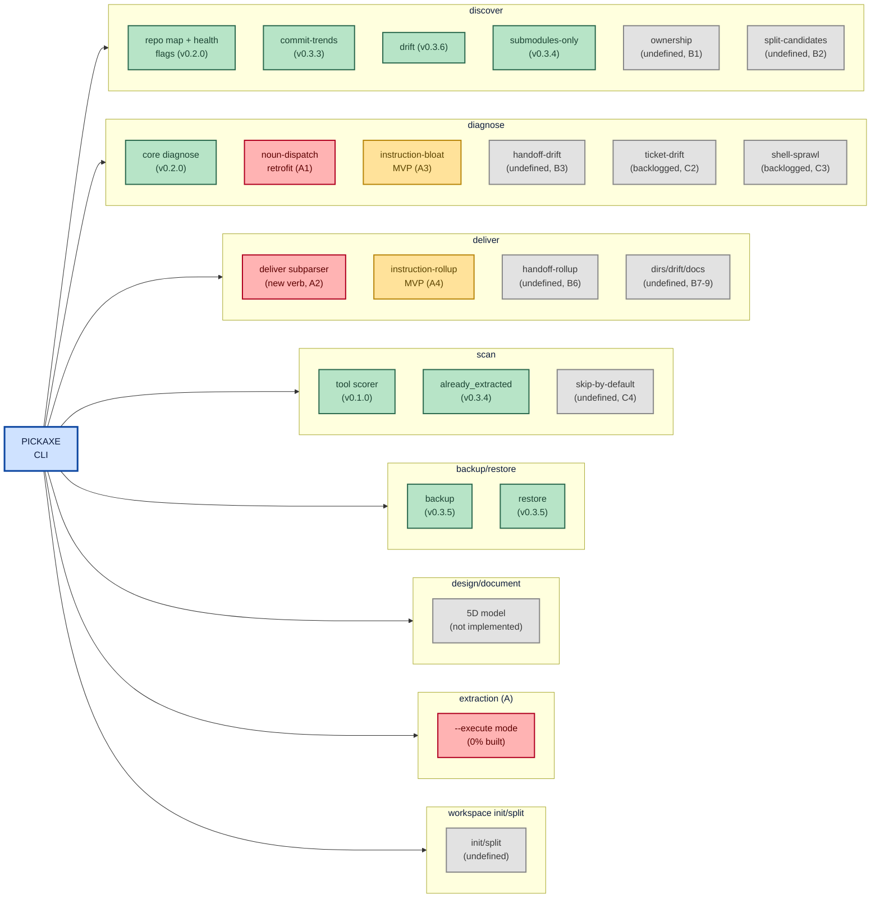

# pickaxe — Features Map (visual overview)

```
# --------------------------------------------------------------------------
# NOTES:    features-map.md
# --------------------------------------------------------------------------
# ABSTRACT: Mermaid visual overview of pickaxe deliverables and gaps —
#     PICKAXE root fanning into per-verb columns (discover/diagnose/scan/
#     backup-restore/deliver/design-document/extraction/workspace), boxes
#     color-coded green/amber/red/grey. Diagram-only by design (split out
#     of a combined doc on 2026-07-29) so it can scroll side by side with
#     features-listing.md, which carries the full checkbox outline, Franklin
#     priorities, and open decisions. Companion to FEATURE.md (intent/scope)
#     and ROADMAP.md (AS-IS/TO-BE narrative).
# CREATED:  260729 BY: Claude(Sonnet5)::WIZ-00.Copilot::pickaxe.SOLOMON
# UPDATED:  260729 BY: Claude(Sonnet5)::WIZ-00.Copilot::pickaxe.SOLOMON
# ARCHITECT: Joe Negron -- LogicWizards.NYC
# TECHLEAD:  JN (Joe Negron -- LogicWizards.NYC)
# VERSION:  0.3.6  (mirrors the pickaxe CLI version; ../ROADMAP.md is
#           canonical. All .HANDOFF docs bump together at every wrap.)
# STAGE:    ACTIVE
# --------------------------------------------------------------------------
```

> **See also:** [`features-listing.md`](features-listing.md) for the full checkbox tracker, Franklin priorities (A1-A4 current sprint, B/C backlog), and open decisions. Kept in sync manually — update both when a verb's status changes.

## Color key

- 🟢 green = shipped, no known gap · 🟡 amber = MVP-scoped/in progress · 🔴 red = blocked (named prerequisite missing) · ⚪ grey = undefined/backlogged

## Visual overview

Swimlanes are verb tracks off the `PICKAXE` root; box fill + text color signal status per the key above. Labels hard-wrap with `\n` near 20-25 chars/line per repo convention (see `AGENTS.md` § Markdown Style).



---

**Full checkbox tracker, priorities, and open decisions:** [`features-listing.md`](features-listing.md)
